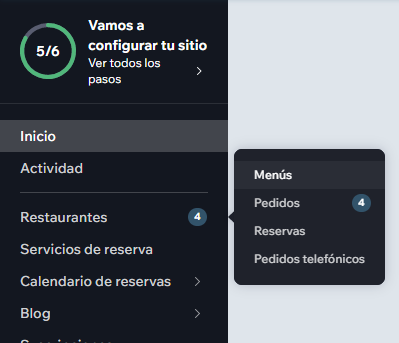
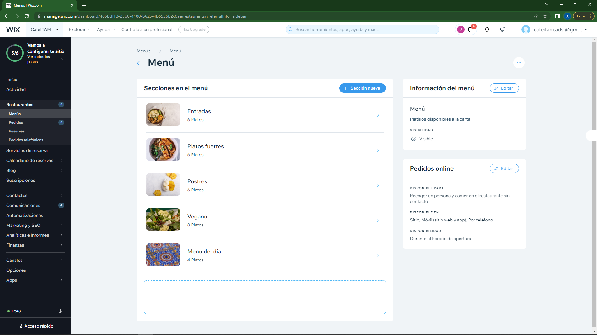

# Prototipo de alto nivel

Elegimos realizar el prototipo en una plataforma con templates: Wix. De esta manera, no tuvimos que concentrarnos tanto en los aspectos técnicos que implican la construcción de una página web y de una aplicación. Además, Wix ofrece la ventaja de que tanto la aplicación como la página web pueden administrarse desde un mismo lugar y se pueden asignar distintos permisos a distintas cuentas: así, podemos poner la cuenta de administrador de la cafetería y únicamente otorgarle permisos de edición del menú, de manera que no mueva el resto de la página.

## La página web
La página web se encuentra en el siguiente url: https://www.cafeitam.com/. A continuación, incluimos las instrucciones para utilizarlas desde las dos perspectivas: para los **clientes** y para los **administradores de la cafetería**.

### Los clientes
Como cliente, se puede hacer un pedido desde la sección de `pedidos en línea`. Ahí se puede navegar a distintas secciones del menú y escoger el platillo que mejor parezca. Una vez seleccionado el platillo que se desea, se elige la cantidad, se agregan los comentarios especiales y se hace click en `Agregar $_ al pedido`. Posteriormente, se hace click en el icono de `ver carrito` y luego en el botón de `finalizar la compra`, que sale en el submenú. La página nos lleva a la parte de selección del horario y día de entrega, solicita la información de contacto, pago y confirmación del pedido. Una vez finalizado el proceso, el sistema nos enviará un correo con la confirmación de la orden para posibles aclaraciones futuras. Lo único que queda es ir a la cafetería y, con el número de pedido, recoger nuestra orden.

### La cafetería
Para editar el menú de la cafetería, hay que hacer lo siguiente:
1. Iniciar sesión en [Wix](https://www.wix.com/). El usuario es `cafeitam.adsi@gmail.com` y la contraseña es `Colmillo2022`.
2. Hacer Restaurantes y luego en Menús

3. Seleccionar `Menú`
4. Escoger la sección a editar y ahí cambiar o agregar lo que se desea

## La aplicación
Para probar la aplicación, se puede descargar la aplicación [Dine by Wix](https://www.dinebywix.com/) en el celular, iniciar sesión con la misma cuenta que arriba y entonces se accede a la parte del restaurante. Para más información, véase el video que se subió al repositorio como tutorial.
